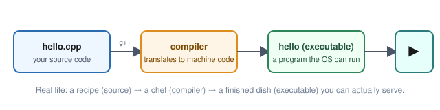

# Lesson 01: Hello, World & Your First Program

Every programming language starts with “Hello, World.”  
C++ is no exception — but we’re going to understand *why* every line exists.

> [!NOTE]
> **Real life:** turning source code into a running program is exactly like turning a recipe into a finished dish — you write instructions (the recipe), a compiler (the chef) follows them precisely, and out comes something you can actually run and use.



> [!TIP]
> **Try it now:** this repo already has this exact program ready to run — open `examples/lesson-01-hello-world.cpp` in your Codespace and press `F5` (Run and Debug). No setup needed, it's wired to the devcontainer's compiler.
>
> **`F5` builds whichever tab is active** — not whichever file you last read. If a lesson
> `.md` file is the focused tab instead of the `.cpp` file, `F5` tries to compile the
> Markdown and fails with a confusing linker error. Click into the `.cpp` file's tab first
> so its editor actually has focus, *then* press `F5`.

---

## The Minimal Program

```cpp
#include <iostream>

int main() {
    std::cout << "Hello, World!\n";
    return 0;
}
```

Save this as `hello.cpp`, then compile and run:

```bash
g++ hello.cpp -o hello
./hello
```

Output:

```text
Hello, World!
```

---

## Line-by-Line Breakdown

### `#include <iostream>`

This is a **preprocessor directive**.  
It tells the compiler: “Please include the contents of the header file called `iostream`.”

`iostream` stands for **input/output stream**.  
It gives us access to `std::cout` (console output) and later `std::cin` (console input).

Without this line, the compiler has no idea what `std::cout` is.

### `int main()`

This is the **entry point** of every C++ program.  
When you run the executable, the operating system looks for a function named `main` and starts executing from there.

- `int` means this function returns an integer.
- The empty parentheses `()` mean it takes no arguments (for now).

You can also write `int main(void)` — it means the same thing.

### `{ ... }`

Curly braces define a **block** of code — the body of the function.

### `std::cout << "Hello, World!\n";`

This is the actual work.

- `std` is a **namespace** (think of it as a container that holds standard library names).
- `cout` means “character output” (console output).
- `<<` is the **stream insertion operator**. It sends data *into* the stream.
- `"Hello, World!\n"` is a **string literal**.
- `\n` is a **newline character**. It moves the cursor to the next line.

You can also write:

```cpp
std::cout << "Hello, World!" << std::endl;
```

`std::endl` also moves to a new line *and* flushes the output buffer.  
For most beginner programs, `\n` is perfectly fine and slightly faster.

### `return 0;`

This tells the operating system: “The program finished successfully.”  
By convention:

- `0` = success
- any non-zero value = some kind of error

In C++ you can actually omit `return 0;` from `main` — the compiler will insert it for you.  
But writing it explicitly is clearer while you’re learning.

---

## Why `std::`?

Everything in the C++ Standard Library lives inside the `std` namespace to avoid name collisions.

You have three common ways to use it:

```cpp
// 1. Fully qualified (recommended for learning)
std::cout << "Hello\n";

// 2. Using declaration (brings one name in)
using std::cout;
cout << "Hello\n";

// 3. Using directive (brings everything in — avoid in headers)
using namespace std;
cout << "Hello\n";
```

> [!TIP]
> **Best practice while learning:** Prefer the fully qualified form `std::cout`. It makes it obvious where each name comes from — like signing a letter with your full name instead of just an initial, so the reader always knows who wrote it.

---

## A Slightly Better Version

```cpp
#include <iostream>

int main() {
    std::cout << "Hello, World!\n";
    std::cout << "This is my first C++ program.\n";
    return 0;
}
```

You can chain multiple insertions:

```cpp
std::cout << "Hello, " << "World!" << "\n";
```

---

## Common Mistakes

| Mistake                              | What happens                          | Fix                          |
|--------------------------------------|---------------------------------------|------------------------------|
| Forgot `#include <iostream>`         | Compiler error: `cout` not declared   | Add the include              |
| Wrote `cout` without `std::`         | Same error                            | Use `std::cout`              |
| Missing semicolon                    | Compiler error                        | Add `;`                      |
| Used single quotes `'Hello'`         | Wrong type (character vs string)      | Use double quotes `"Hello"`  |
| Named the function `Main` or `MAIN`  | Linker error (entry point not found)  | Must be exactly `main`       |

---

## Exercises

1. Change the message to print your name.
2. Print three different lines using three separate `std::cout` statements.
3. Print three different lines using **one** `std::cout` statement (use `\n`).
4. What happens if you remove the `\n`? Try it.
5. Add a second `return 0;` at the end. Does it still compile? Why or why not?

---

## Challenge

Write a program that prints this exact output (including the blank line):

```text
====================
  C++ Tutorial v1
====================

Hello, World!
```

> [!TIP]
> **Try it now:** create a new file in `examples/` (or edit `lesson-01-hello-world.cpp` temporarily), write your version, then hit `F5`. Seeing your own output appear is a genuinely different feeling than reading someone else's — don't skip this one.

---

## Summary

- Every C++ program needs a `main` function.
- `#include <iostream>` gives you console output.
- `std::cout << value;` sends data to the console.
- `\n` creates a new line.
- `return 0;` signals successful completion.

---

## Next Lesson

→ [Lesson 02: Variables, Types & Basic I/O](02-variables-types.md)
