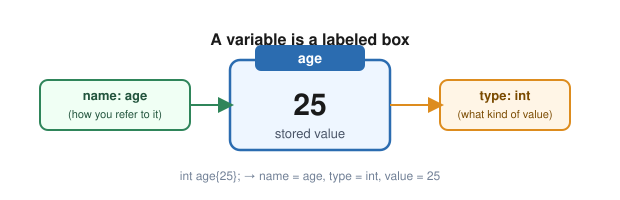

# Lesson 02: Variables, Types & Basic I/O

Variables are how a C++ program remembers information while it runs.

> [!NOTE]
> **Goal:** Create typed variables, initialize them safely, print their values, accept simple user input, and explain what each variable represents.

---

## What You Will Learn

- What a variable is
- What a data type tells the compiler
- `int`, `double`, `char`, and `bool`
- Initialization vs assignment
- `const` variables
- `std::cout` and `std::cin`
- Basic input-validation awareness
- How to inspect variables in the VS Code debugger

---

## 1. Mental Model: A Variable Is Named Storage

A useful beginner mental model is:

> **A variable is a named piece of memory that stores a value of a particular type.**

> [!NOTE]
> **Real life:** a variable is a labeled storage box — like a jar with a name tag on the shelf. The name tag (`age`) is how you find it, the jar's shape (`int`) tells you what kind of thing can go inside, and what's actually sitting in the jar right now (`25`) is the value.

For example:

```cpp
int age{25};
```

For now, think of a variable as three things:



We will revisit the memory side of this when we study pointers, the stack, and the heap.

---

## 2. Common Fundamental Types

| Type | Stores | Example |
| --- | --- | --- |
| `int` | Whole numbers | `42` |
| `double` | Numbers with fractional parts | `3.14159` |
| `char` | One character | `'A'` |
| `bool` | `true` or `false` | `true` |

Example:

```cpp
#include <iostream>

int main()
{
    int age{25};
    double price{19.99};
    char grade{'A'};
    bool isStudent{true};

    std::cout << age << '\n';
    std::cout << price << '\n';
    std::cout << grade << '\n';
    std::cout << isStudent << '\n';

    return 0;
}
```

By default, printing a `bool` produces `1` for `true` and `0` for `false`.

---

## 3. Initialization

Initialization gives an object its first value. For modern C++, prefer brace initialization when appropriate:

```cpp
int age{25};
double price{19.99};
char grade{'A'};
bool active{true};
```

You can also value-initialize an object:

```cpp
int score{};
```

Here, `score` starts at `0`.

### Why braces?

Brace initialization helps prevent certain narrowing conversions:

```cpp
int number{3.14}; // error: narrowing conversion
```

C++ refuses to silently discard the fractional part in this form.

---

## 4. Assignment

Initialization happens when an object is created. Assignment changes an existing object's value:

```cpp
int score{10};

score = 20;
score = 30;
```

Think:

```text
initialization → first value
assignment     → later value
```

---

## 5. `const`: Values That Should Not Change

Use `const` when a value should remain unchanged after initialization:

```cpp
const double taxRate{0.0825};
```

Trying to change it later is an error:

```cpp
// taxRate = 0.10; // error
```

A useful rule is:

> If a value should not change, make that intent visible with `const`.

---

## 6. Output with `std::cout`

Use `std::cout` to print variables:

```cpp
#include <iostream>

int main()
{
    int age{25};

    std::cout << "Age: " << age << '\n';

    return 0;
}
```

The `<<` operator lets you send multiple pieces of information into the output stream.

```cpp
std::cout << "Age: " << age << '\n';
```

Read it as: send the text, then the value of `age`, then a newline to the console.

---

## 7. Input with `std::cin`

`std::cin` lets the user enter data through the console:

```cpp
#include <iostream>

int main()
{
    int age{};

    std::cout << "Enter your age: ";
    std::cin >> age;

    std::cout << "You are " << age << " years old.\n";

    return 0;
}
```

The important line is:

```cpp
std::cin >> age;
```

The `>>` extraction operator attempts to read input from the stream and store it in `age`.

If the user enters `25`, `age` becomes `25`.

> [!IMPORTANT]
> `std::cin` can enter a failed state when the input does not match the expected type. Full input validation comes later; for now, learn to recognize that user input is not automatically trustworthy — the same way a form on a website shouldn't blindly trust whatever gets typed into it.

---

## 8. Complete Example

```cpp
#include <iostream>

int main()
{
    const double taxRate{0.0825};
    double price{};

    std::cout << "Enter the price: ";
    std::cin >> price;

    double tax{price * taxRate};
    double total{price + tax};

    std::cout << "Price: $" << price << '\n';
    std::cout << "Tax:   $" << tax << '\n';
    std::cout << "Total: $" << total << '\n';

    return 0;
}
```

Notice the roles:

- `taxRate` never changes → `const`
- `price` comes from the user
- `tax` and `total` are calculated from the input

The goal is to choose variables based on what the program needs to represent.

> [!TIP]
> **Try it now:** this exact program is already in `examples/lesson-02-variables.cpp`. Open it in your Codespace, set a breakpoint on the `tax` line, and press `F5` — you'll see `price` sitting in the **Variables** pane the instant you type it in.

---

## 9. Common Beginner Mistakes

| Mistake | What happens | Better approach |
| --- | --- | --- |
| `int price{19.99};` | Narrowing conversion error | Use `double` for fractional values |
| `char name{'Alex'};` | Too many characters for `char` | Use a string type when you learn strings |
| `const int x{};` | Must be initialized before use | Give `const` its value immediately |
| `std::cin >> age` with text input | Input can enter a failed state | Learn validation before relying on arbitrary input |
| Using `=` when comparing values | Assignment is performed | Comparisons are covered in the operators lesson |
| `using namespace std;` everywhere | Can create name collisions | Prefer explicit `std::` while learning |

---

## Exercises

### Exercise 1 — Personal Profile

Create variables for:

- your age (`int`)
- your height (`double`)
- your first initial (`char`)
- whether you are learning C++ (`bool`)

Print all four with labels.

### Exercise 2 — Change a Variable

Create:

```cpp
int score{0};
```

Assign it three different values and print the result after each assignment.

### Exercise 3 — User Input

Ask the user for their age and favorite number. Print both values.

### Exercise 4 — Constant

Create a `const double` representing the number of inches in a foot. Convert a user-entered number of feet into inches.

### Exercise 5 — Predict Before Running

What will this print?

```cpp
int x{10};
int y{x};
x = 20;

std::cout << x << '\n';
std::cout << y << '\n';
```

Write down your answer before running it. Then test it.

---

## Debugger Exercise: Watch Your Variables

In VS Code:

1. Open the **Run and Debug** panel.
2. Select **Debug active C++ file**.
3. Put a breakpoint on:

   ```cpp
   double tax{price * taxRate};
   ```

4. Start debugging and enter a price in the integrated terminal.
5. When execution stops, inspect `price`, `taxRate`, and `total` in the **Variables** pane.
6. Step to the next line and watch `tax` appear.
7. Continue and observe the final output.
8. Add a variable to the **Watch** pane when you want to monitor it across steps.

Your goal is to **see program state change while the program runs**, not merely make the program work.

LearnCpp debugger references:

- [Running and Breakpoints](https://www.learncpp.com/cpp-tutorial/using-an-integrated-debugger-running-and-breakpoints/)
- [Watching Variables](https://www.learncpp.com/cpp-tutorial/using-an-integrated-debugger-watching-variables/)

---

## Checkpoint Project: Personal Finance Snapshot

Build a console program that asks for:

- monthly income
- monthly rent
- monthly food spending
- monthly transportation spending

Then calculate the money remaining.

Example output:

```text
Monthly income:       $3000
Rent:                 $1200
Food:                  $400
Transportation:        $250
-----------------------------
Money remaining:      $1150
```

### Requirements

Your program must:

- use at least three numeric variables
- use `std::cin`
- use `std::cout`
- calculate the remaining amount
- use `const` for at least one value that should not change
- compile without warnings you understand to be avoidable

**Do not copy a finished solution.** Build it from this lesson.

---

## Summary

You should now understand:

- A variable has a name, type, and value.
- `int` stores whole numbers.
- `double` stores fractional numeric values.
- `char` stores a single character.
- `bool` stores `true` or `false`.
- Initialization gives an object its first value.
- Assignment changes an existing value.
- `const` expresses that a value should not change.
- `std::cout` writes output.
- `std::cin` reads basic input.
- The debugger lets you inspect variable state while the program runs.

---

## Next Lesson

→ [Lesson 03: Operators & Expressions](03-operators.md)
