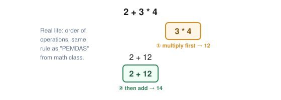

# Lesson 03: Operators & Expressions

Operators are the symbols that let a C++ program calculate, compare, and combine values.

> [!NOTE]
> **Goal:** By the end of this lesson, you should be able to perform arithmetic, understand assignment versus comparison, build Boolean expressions, and predict the result of simple expressions before running them.

---

## What You Will Learn

- Arithmetic operators: `+`, `-`, `*`, `/`, `%`
- Assignment: `=`
- Compound assignment: `+=`, `-=`, `*=`, `/=`
- Increment and decrement: `++`, `--`
- Comparison operators: `==`, `!=`, `<`, `>`, `<=`, `>=`
- Logical operators: `&&`, `||`, `!`
- Integer division
- Operator precedence and parentheses
- Why `=` and `==` are different
- How to inspect expressions in the VS Code debugger

---

## 1. What Is an Expression?

An **expression** is code that produces a value.

```cpp
2 + 3
```

produces `5`.

So does:

```cpp
int x{2};
int y{3};
int result{x + y};
```

Here, `x + y` is an expression and its value is used to initialize `result`.

An **operator** tells C++ what operation to perform.

```text
2 + 3
  ↑
operator
```

---

## 2. Arithmetic Operators

The basic arithmetic operators are:

| Operator | Meaning | Example | Result |
|---|---|---|---:|
| `+` | addition | `5 + 2` | `7` |
| `-` | subtraction | `5 - 2` | `3` |
| `*` | multiplication | `5 * 2` | `10` |
| `/` | division | `10 / 2` | `5` |
| `%` | remainder | `10 % 3` | `1` |

Example:

```cpp
#include <iostream>

int main()
{
    int a{10};
    int b{3};

    std::cout << a + b << '\n';
    std::cout << a - b << '\n';
    std::cout << a * b << '\n';
    std::cout << a / b << '\n';
    std::cout << a % b << '\n';

    return 0;
}
```

---

## 3. The Integer Division Trap

One of the most important beginner surprises is that integer division produces an integer result.

```cpp
int result{7 / 2};
```

`result` is `3`, not `3.5`.

The fractional part is discarded because both operands are integers.

If you want a fractional result, use a floating-point operand:

```cpp
double result{7.0 / 2};
```

Now the result is `3.5`.

> [!NOTE]
> **Real life:** this is exactly why splitting a restaurant bill among people can go wrong if you're not careful — $10 split 3 ways with integer math would silently "lose" a few cents unless you use decimals.

> [!TIP]
> **Experiment:** Predict the result of `9 / 4`, `9.0 / 4`, and `9 / 4.0` before running them.

---

## 4. Assignment Is an Operation

The `=` operator assigns a value to an existing object.

```cpp
int score{10};
score = 25;
```

After the assignment, `score` contains `25`.

You can also calculate during assignment:

```cpp
int score{10};
score = score + 5;
```

Now `score` is `15`.

---

## 5. Compound Assignment

C++ provides shorter forms for common updates:

```cpp
score += 5;
score -= 2;
score *= 3;
score /= 4;
```

For example:

```cpp
int score{10};
score += 5;
```

is equivalent to:

```cpp
score = score + 5;
```

These operators become especially useful when we start writing loops.

---

## 6. Increment and Decrement

The `++` operator increases a value by one.

```cpp
int count{0};
count++;
```

Now `count` is `1`.

Similarly:

```cpp
count--;
```

subtracts one.

For now, treat these as convenient ways to change a variable by one. The difference between prefix and postfix forms becomes important in more advanced expressions, so avoid trying to make clever one-line expressions with them while learning.

---

## 7. Comparison Operators

Comparison operators ask a question and produce a Boolean result (`true` or `false`).

| Operator | Meaning |
|---|---|
| `==` | equal to |
| `!=` | not equal to |
| `<` | less than |
| `>` | greater than |
| `<=` | less than or equal to |
| `>=` | greater than or equal to |

Example:

```cpp
int age{25};

bool isAdult{age >= 18};
```

`isAdult` becomes `true`.

### `=` versus `==`

This distinction is critical:

```cpp
x = 10;   // assign 10 to x
x == 10;  // ask whether x equals 10
```

They are completely different operations.

---

## 8. Logical Operators

Logical operators combine or reverse Boolean expressions.

### AND: `&&`

Both conditions must be true:

```cpp
bool canEnter{age >= 18 && hasTicket};
```

### OR: `||`

At least one condition must be true:

```cpp
bool qualifies{isStudent || isVeteran};
```

### NOT: `!`

Reverses a Boolean value:

```cpp
bool active{true};
bool inactive{!active};
```

`inactive` becomes `false`.

---

## 9. Operator Precedence

C++ follows rules that determine which operations happen first.

For example:

```cpp
int result{2 + 3 * 4};
```

The multiplication happens first, so the result is `14`.



When readability matters, use parentheses:

```cpp
int result{(2 + 3) * 4};
```

Now the result is `20`.

> [!TIP]
> **Beginner rule:** Don't rely on memorizing a giant precedence table. When an expression could be misunderstood, use parentheses.

---

## 10. A Complete Example

```cpp
#include <iostream>

int main()
{
    double price{};
    double quantity{};

    std::cout << "Enter price: ";
    std::cin >> price;

    std::cout << "Enter quantity: ";
    std::cin >> quantity;

    double subtotal{price * quantity};
    const double freeShippingThreshold{50.0};
    bool qualifiesForFreeShipping{subtotal >= freeShippingThreshold};

    std::cout << "Subtotal: $" << subtotal << '\n';
    std::cout << "Free shipping: "
              << (qualifiesForFreeShipping ? "yes" : "no")
              << '\n';

    return 0;
}
```

The important part is not the final program. Notice how each expression has a job:

```text
price * quantity
       ↓
   subtotal
       ↓
subtotal >= threshold
       ↓
Boolean decision
```

We will formally introduce `if` statements in the next lesson.

> [!TIP]
> **Try it now:** open `examples/lesson-03-operators.cpp` and press `F5`. Enter a price and quantity, then check whether "Free shipping" flips to `yes` once your subtotal crosses $50.

---

## Exercises

### Exercise 1 — Basic Arithmetic

Create two `int` variables and print their:

- sum
- difference
- product
- quotient
- remainder

### Exercise 2 — Predict Integer Division

Without running the program, predict the output:

```cpp
int a{17};
int b{5};

std::cout << a / b << '\n';
std::cout << a % b << '\n';
```

Then test your prediction.

### Exercise 3 — Temperature Conversion

Ask the user for a temperature in Celsius and convert it to Fahrenheit using:

```text
F = C × 9 / 5 + 32
```

Use `double` so fractional temperatures work correctly.

### Exercise 4 — Comparisons

Ask for a number and create Boolean variables answering:

- Is it positive?
- Is it negative?
- Is it zero?
- Is it greater than 100?

Print each answer.

### Exercise 5 — Compound Assignment

Start with:

```cpp
int points{100};
```

Then apply these operations:

```text
+25
-10
×2
÷5
```

Print the value after every operation.

### Exercise 6 — Boolean Logic

Create variables representing:

```text
age >= 18
hasLicense
hasInsurance
```

Create a Boolean expression that determines whether someone is legally ready to drive.

---

## Debugger Exercise: Watch an Expression Change State

In VS Code:

1. Open the **Run and Debug** panel.
2. Start the **Debug active C++ file** configuration.
3. Put a breakpoint immediately before an expression such as:
   ```cpp
   int total{price * quantity};
   ```
4. Run the debugger and provide the program's input in the integrated terminal.
5. When execution stops, inspect `price` and `quantity` in the **Variables** pane.
6. Step over the calculation.
7. Inspect `total` in **Variables**.
8. Add `total` to the **Watch** pane.
9. Change the program so `total` is updated with `+=` and watch it change again.

Then create a Boolean expression such as:

```cpp
bool expensive{total > 100};
```

Stop before and after the expression executes and observe when `expensive` appears and what value it receives.

**Debugger question:** Can you explain why the value of `total` changes only after its declaration/expression executes?

---

## Checkpoint Project: Console Calculator

Build a calculator that asks the user for two numbers and an operation.

Example:

```text
=== C++ Calculator ===
First number: 12
Operation (+ - * /): *
Second number: 4

Result: 48
```

### Requirements

Your first version should support:

- addition
- subtraction
- multiplication
- division
- remainder for integer inputs

It must:

- use variables
- use `std::cin` and `std::cout`
- use arithmetic operators
- use at least one comparison
- avoid dividing by zero
- use parentheses where they improve readability

**Do not use functions yet.** The point of this project is to practice expressions before we introduce functions in Lesson 05.

### Stretch Challenge

Add a Boolean variable that records whether the operation is valid.

Do not worry about building a polished menu yet. Lesson 04 will give you the control-flow tools needed to make the calculator much better.

---

## Summary

You should now understand:

- Expressions produce values.
- Operators perform operations on values.
- Integer division can discard a fractional part.
- `=` assigns; `==` compares.
- Compound assignment updates an existing value.
- `++` and `--` change a value by one.
- Comparisons produce Boolean results.
- `&&`, `||`, and `!` combine or reverse Boolean expressions.
- Parentheses can make expressions clearer and change evaluation order.
- The debugger lets you observe expression results as execution progresses.

---

## Next Lesson

→ [Lesson 04: Control Flow — if, switch, loops](04-control-flow.md)
