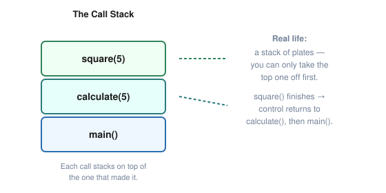

# Lesson 05: Functions

Functions let you divide a program into named, reusable pieces of work.

> [!NOTE]
> **Real life:** a function is like a vending machine. You don't need to know how it makes change or dispenses the snack internally — you put in the right input (money + selection) and you reliably get the right output (your snack). That's the whole point of a function: a predictable job you can call on without re-explaining how it works each time.

> [!NOTE]
> **Goal:** By the end of this lesson, you should be able to write functions, pass information into them, return results, understand local scope, and decide when code belongs in a separate function.

---

## What You Will Learn

- What a function is
- Function declarations and definitions
- Parameters and arguments
- Return values
- `void` functions
- Local variables and scope
- Function composition
- Passing by value
- Basic function design
- Debugging function calls with the VS Code call stack

---

## 1. Why Functions Exist

Imagine a program that calculates a total in five different places. Without functions, you may end up copying the same calculation repeatedly.

Functions give that work a name:

```cpp
double calculateTotal(double price, double taxRate)
{
    return price + (price * taxRate);
}
```

Now the rest of the program can ask for that operation by calling:

```cpp
double total{calculateTotal(100.0, 0.08)};
```

A function is a named unit of behavior.

---

## 2. The Simplest Function

Here is a function that prints a message:

```cpp
#include <iostream>

void sayHello()
{
    std::cout << "Hello!\n";
}

int main()
{
    sayHello();
    return 0;
}
```

Break the definition apart:

```text
void     sayHello     ()
 │          │          │
return     name      parameters
 type
```

`void` means the function does not return a value.

---

## 3. Calling a Function

A function does not execute merely because it exists.

This defines it:

```cpp
void sayHello()
{
    std::cout << "Hello!\n";
}
```

This calls it:

```cpp
sayHello();
```

Think:

```text
function definition → describes the work
function call       → performs the work
```

---

## 4. Parameters and Arguments

Functions can receive information.

```cpp
void greet(int age)
{
    std::cout << "Age: " << age << '\n';
}
```

Here, `age` is a **parameter**.

When we call it:

```cpp
greet(25);
```

`25` is an **argument**.

A useful distinction:

```text
parameter → variable listed in the function definition
argument  → value supplied by the caller
```

---

## 5. Multiple Parameters

A function can accept several values:

```cpp
void printProfile(int age, double height)
{
    std::cout << "Age: " << age << '\n';
    std::cout << "Height: " << height << '\n';
}
```

Call it with:

```cpp
printProfile(25, 1.8);
```

The arguments are matched to parameters in order.

---

## 6. Return Values

A function can calculate something and send the result back to its caller.

```cpp
int add(int a, int b)
{
    return a + b;
}
```

Then:

```cpp
int result{add(5, 3)};
```

The function returns `8`, which is used to initialize `result`.

The return type appears before the function name:

```text
int add(...)
↑
return type
```

---

## 7. `void` vs. Value-Returning Functions

Use `void` when the function performs an action without producing a result for the caller:

```cpp
void printMenu()
{
    std::cout << "1. Start\n";
    std::cout << "2. Quit\n";
}
```

Use a value-returning function when the caller needs a result:

```cpp
int square(int number)
{
    return number * number;
}
```

A useful design question is:

> [!TIP]
> **Does the caller need a value back, or does this function simply perform an action?**

---

## 8. Function Scope

Variables declared inside a function are local to that function.

```cpp
void example()
{
    int score{100};
    std::cout << score << '\n';
}
```

This does not work:

```cpp
void example()
{
    int score{100};
}

int main()
{
    std::cout << score; // error
}
```

`score` belongs to the scope of `example`.

This is one reason functions help keep programs organized: each function can have its own local state.

---

## 9. Passing by Value

For the basic functions in this lesson, arguments are passed by value.

```cpp
void change(int number)
{
    number = 100;
}

int main()
{
    int x{10};
    change(x);

    std::cout << x << '\n';
}
```

`x` remains `10`.

The function receives its own parameter value. We will later learn references and how to intentionally allow a function to modify the caller's object.

---

## 10. Function Declarations

C++ generally needs to know about a function before the point where it is called.

This works because the function is defined before `main`:

```cpp
int square(int number)
{
    return number * number;
}

int main()
{
    std::cout << square(5) << '\n';
}
```

You can also declare the function first:

```cpp
int square(int number);

int main()
{
    std::cout << square(5) << '\n';
}

int square(int number)
{
    return number * number;
}
```

The first line is a **function declaration** (also called a prototype). It tells the compiler that the function exists and describes how it can be called.

---

## 11. Function Composition

Useful programs are built from functions that cooperate.

```cpp
int add(int a, int b)
{
    return a + b;
}

int doubleValue(int value)
{
    return value * 2;
}

int main()
{
    int sum{add(3, 4)};
    int result{doubleValue(sum)};

    std::cout << result << '\n';
}
```

The flow is:

```text
main
 ↓
add(3, 4)
 ↓
sum = 7
 ↓
doubleValue(7)
 ↓
result = 14
```

This is the beginning of decomposing a larger problem into smaller problems.

---

## 12. Complete Example: Calculator Functions

```cpp
#include <iostream>

int add(int a, int b)
{
    return a + b;
}

int subtract(int a, int b)
{
    return a - b;
}

int multiply(int a, int b)
{
    return a * b;
}

int main()
{
    int first{};
    int second{};

    std::cout << "First number: ";
    std::cin >> first;

    std::cout << "Second number: ";
    std::cin >> second;

    std::cout << "Add: " << add(first, second) << '\n';
    std::cout << "Subtract: " << subtract(first, second) << '\n';
    std::cout << "Multiply: " << multiply(first, second) << '\n';

    return 0;
}
```

Each function has one obvious responsibility.

That is a strong beginner design habit:

> [!TIP]
> **Prefer small functions with clear jobs over one giant `main()` function.**

> [!TIP]
> **Try it now:** open `examples/lesson-05-functions.cpp` and press `F5`. Set a breakpoint inside one of the arithmetic functions and check the **CALL STACK** panel — you'll see `main()` sitting underneath it, exactly like the diagram in the debugger exercise below.

---

## Exercises

### Exercise 1 — Greeting Function

Write:

```cpp
void greet()
```

It should print a greeting. Call it three times.

### Exercise 2 — Add Function

Write:

```cpp
int add(int a, int b)
```

Return the sum of the two arguments.

### Exercise 3 — Larger Number

Write a function that accepts two integers and returns the larger one.

Do not use `std::max` yet. Practice the logic yourself.

### Exercise 4 — Temperature Function

Write:

```cpp
double celsiusToFahrenheit(double celsius)
```

Return the converted temperature.

### Exercise 5 — Scope Experiment

Create a local variable inside a function. Try to access it from `main`. Read the compiler error carefully.

### Exercise 6 — Calculator Functions

Create functions for:

- addition
- subtraction
- multiplication
- division

Call each from `main`.

### Exercise 7 — Composition

Create:

```cpp
int square(int number)
```

Then create a second function that calls `square()` and performs another calculation with the result.

---

## Debugger Exercise: Follow the Call Stack

This is the first lesson where the **Call Stack** becomes especially useful.

Use this program:

```cpp
#include <iostream>

int square(int number)
{
    return number * number;
}

int calculate(int value)
{
    return square(value) + 10;
}

int main()
{
    int result{calculate(5)};
    std::cout << result << '\n';

    return 0;
}
```

In VS Code:

1. Open the **Run and Debug** panel.
2. Select **Debug active C++ file**.
3. Put a breakpoint inside `square()`.
4. Start debugging.
5. When execution stops, inspect the **Variables** pane.
6. Open the **CALL STACK** section in the Run and Debug view.
7. Observe the chain:
   ```text
   square()
   calculate()
   main()
   ```



8. Step out of `square()`.
9. Watch execution return to `calculate()`.
10. Continue until `main()` receives the final result.

### Debugger question

At the breakpoint inside `square()`, answer:

- What is the current parameter value?
- Which function called `square()`?
- Which function called that function?
- What value will `square()` return?

You are beginning to learn how to trace a real program instead of guessing from the source code.

---

## Checkpoint Project: Console Calculator v2

Upgrade the Lesson 03 calculator.

The calculator should now use separate functions for its operations.

Suggested structure:

```text
main()
 ├── add()
 ├── subtract()
 ├── multiply()
 └── divide()
```

### Requirements

- Use separate functions for arithmetic operations.
- Pass numbers into functions as parameters.
- Return calculated results.
- Keep `main()` responsible for coordinating the program.
- Prevent division by zero.
- Use the debugger to trace at least one function call.

### Design constraint

Do **not** put all calculator logic into one enormous function.

The purpose of this project is learning decomposition, not building a feature-heavy calculator.

---

## Summary

You should now understand:

- A function is a named unit of behavior.
- A function definition describes what it does.
- A function call executes it.
- Parameters receive values from callers.
- Arguments are the values supplied by callers.
- A function can return a value.
- `void` functions perform actions without returning a value.
- Local variables belong to their function's scope.
- Basic arguments are passed by value.
- Functions can call other functions.
- The Call Stack shows how execution reached the current function.

---

## Part 0 Checkpoint

You have now completed the foundation sequence:

```text
Lesson 00 → Setup
Lesson 01 → Program structure
Lesson 02 → Variables and I/O
Lesson 03 → Operators and expressions
Lesson 04 → Control flow
Lesson 05 → Functions
```

Before moving into arrays, strings, vectors, pointers, and memory, you should be able to build a small console program from scratch using these concepts.

### Final Part 0 challenge

Build a small **menu-driven console application** using only what you have learned so far.

It must contain:

- variables
- input/output
- arithmetic
- `if`/`else` or `switch`
- at least one loop
- at least three functions

Do not copy a finished solution.

If you can build it, debug it, and explain why each function exists, you are ready for Part 1.

---

## Next Lesson

→ [Lesson 06: Arrays, Strings & Vectors](06-arrays-strings-vectors.md)
